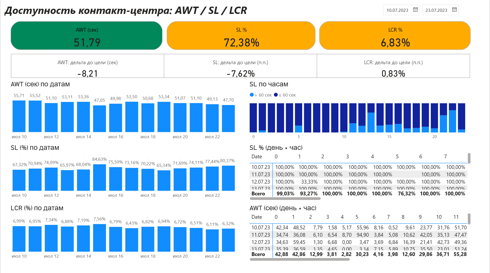
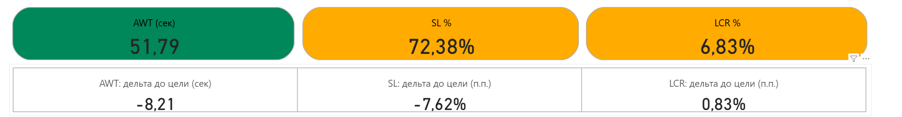
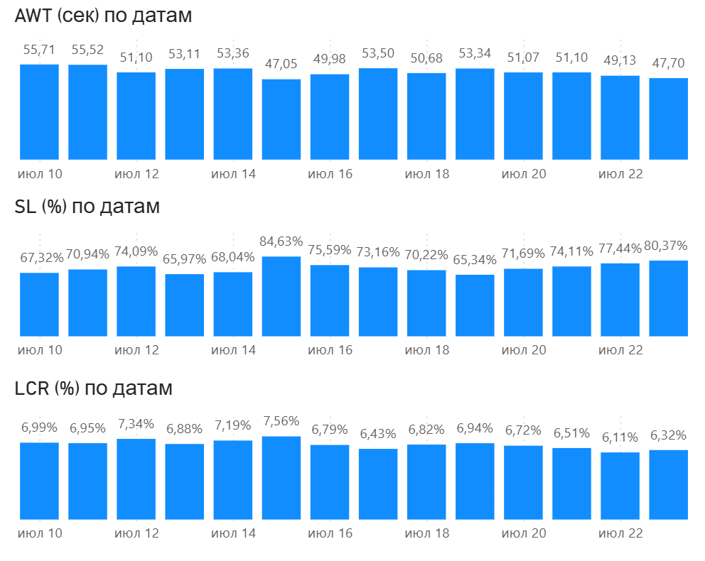
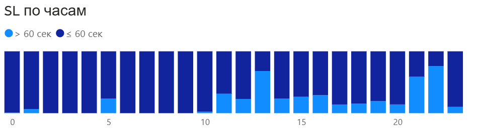
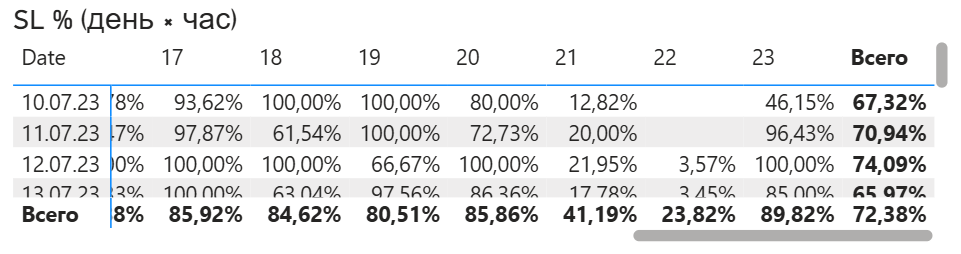

# Доступность контакт-центра: AWT / SL / LCR (Power BI + SQL)

<p align="center">
  <a href="pbix/CallCenter_Availability.pbix?raw=1"><b>⬇️ Скачать отчёт (.pbix)</b></a><br/>
  Power BI Desktop: <b>2.148.878.0 (Октябрь 2025)</b>
</p>

## О проекте
Ежедневный мониторинг доступности линии:
- **AWT** (Average Waiting Time) — среднее ожидание до ответа, цель **≤ 60 сек**  
- **SL** (Service Level) — доля ответов ≤60 сек среди всех отвеченных, цель **≥ 80%**  
- **LCR** (Lost Call Rate) — доля потерянных среди распределённых, цель **≤ 6%**

Итог:
- **AWT ~ 51–52 сек** → цель выполняется  
- **SL ~ 72–74%** → ниже цели на ~6–8 п.п.  
- **LCR ~ 6.5–7.0%** → немного выше цели (на 0.5–1.0 п.п.)  
- Почасовые провалы: **13:00** и **22:00** (падает SL, растёт AWT)

## Источники данных
Папка [`/data`](data):
- `Enter_Answer.csv` — `time_utc4, phone_id, enter, answer, connid`
- `AWT_AHT.csv` — `time_utc3, phone_id, aht, awt, connid`

## Модель данных
Связи:
- `Calendar[Date] (1) → Enter_Answer[date] (*)` (активная)  
- `stg_AWT[connid] (1) → Enter_Answer[connid] (*)` (активная)

Подготовка (Power Query):
- В `Enter_Answer`: добавить `date = Date.From([time_utc4])`, `hour = Time.Hour(Time.From([time_utc4]))`
- В `AWT_AHT`: добавить `date = Date.From([time_utc3])`
- `stg_AWT`: дубликат `AWT_AHT` с полями `connid, awt` + удалить дубли по `connid`

## KPI и методика расчётов
- **AWT (сек)** — среднее `awt` по отвеченным (`enter=1 & answer=1`) после связи `connid`
- **SL (%)** = `(ответы ≤ 60 сек)` / `(все отвеченные)`
- **LCR (%)** = `(потерянные)` / `(распределённые)`
- Цвет KPI:
  - AWT ≤60 — зелёный; 60–75 — жёлтый; >75 — красный  
  - SL ≥80% — зелёный; 70–80% — жёлтый; <70% — красный  
  - LCR ≤6% — зелёный; 6–10% — жёлтый; >10% — красный

## Визуализации
- **Общий дашборд** — KPI, дельты до цели, тренды, почасовой SL, тепловая карта  
  

- **Карточки KPI** — AWT / SL / LCR + фон по цветовым мерам  
  

- **Тренды по датам** — AWT, SL, LCR  
  

- **SL по часам** — нормированная гистограмма (≤60 / >60)  
  

- **Тепловая «день×час»** — SL, быстро видно провалы  
  

## Как воспроизвести
1. **Импорт CSV**: *Главная → Получить данные → Текст/CSV* → загрузить `Enter_Answer.csv` и `AWT_AHT.csv`  
   Типы: `enter/answer` — целое; `awt/aht` — число; `connid` — текст; `time_*` — дата/время
2. **Power Query**: добавить `date`/`hour` как указано выше; сделать `stg_AWT` (connid, awt, без дублей)
3. **Модель**: создать `Calendar` (DAX), отметить как «Таблица дат»; связи как в блоке «Модель данных»
4. **Меры**: добавить из папки [`/dax`](dax)  
5. **Визуалы**: KPI-карточки, тренды, нормированная гистограмма SL по часам, матрица «день×час», срез `Calendar[Date]` (Between)

## SQL-запросы
Файлы в [`/sql`](sql). Базовые агрегаты:

```sql
-- 1) AWT (среднее ожидание по отвеченным)
SELECT AVG(TIMESTAMPDIFF(SECOND, enter, answer)) AS AWT
FROM Enter_Answer
WHERE answer IS NOT NULL;

-- 2) SL (% ответов ≤60 сек среди отвеченных)
SELECT (COUNT(CASE WHEN TIMESTAMPDIFF(SECOND, enter, answer) <= 60 THEN 1 END) / COUNT(*)) * 100 AS SL
FROM Enter_Answer
WHERE answer IS NOT NULL;

-- 3) LCR (% потерянных среди распределённых)
SELECT (COUNT(CASE WHEN answer IS NULL THEN 1 END) / COUNT(*)) * 100 AS LCR
FROM Enter_Answer;
